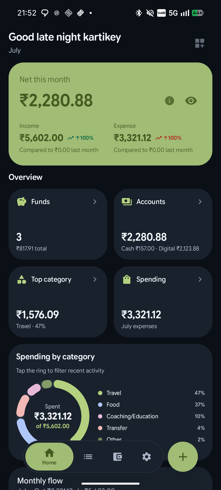
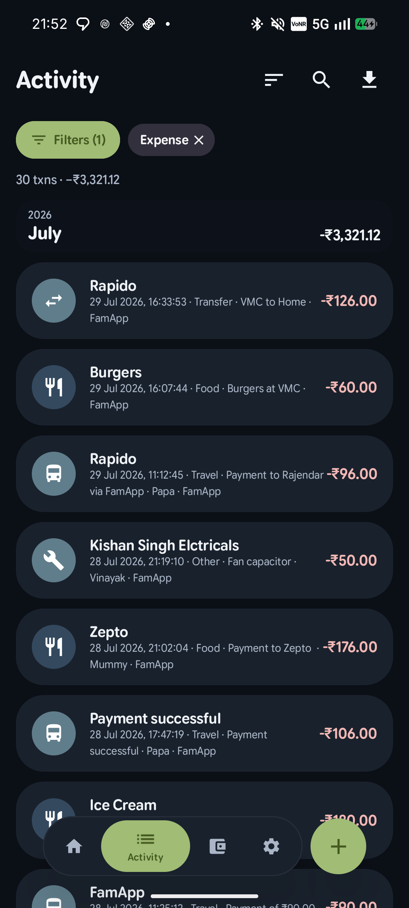
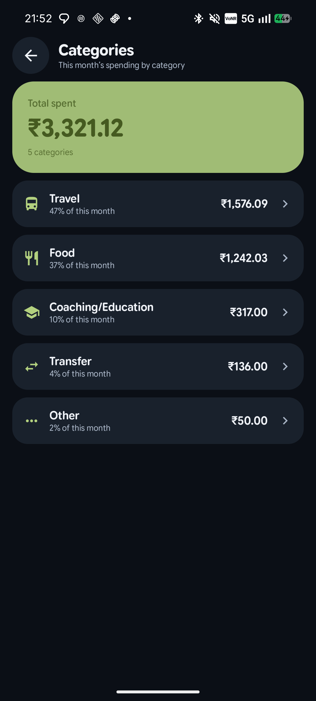
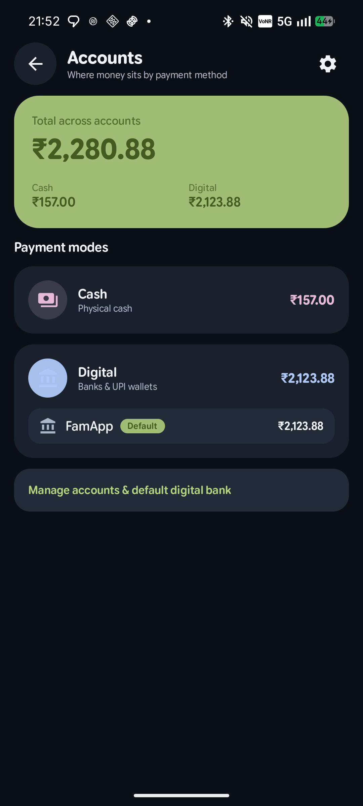

# Rupiyah

**Android app that keeps a personal ledger of your money in ₹.**  
Open source · offline-first · no bank login · [Apache 2.0](LICENSE)

[](LICENSE)


<p align="center">
  
</p>

---

## What this app does

Rupiyah is a **personal expense and income tracker** for day-to-day money in India. It answers: *what did I spend, where, from which wallet, and how does that fit my budget?*

It does **not** connect to your bank account or UPI app as a client. It does **not** move money. It only records and organises spends/income you already made.

### How money gets into the app

1. **Auto from bank alerts (main path)**  
   When you pay with UPI/card/wallet, your bank or app usually emails or SMS’s you. Rupiyah can watch those messages (Gmail / IMAP and optional SMS), keep only senders you trust, then **parse amount + merchant** into a transaction. Parsing uses local rules first; messy texts need an **AI (LLM) API key** — email/SMS auto-import requires that AI to be set up.

2. **Manual entry**  
   Tap **+**, enter an amount on the numpad, pick expense or income, category, fund, account, notes, optional receipt. Works with **no** email, SMS, or AI.

3. **Restore**  
   Import a previous JSON backup (includes transactions and settings).

### What you can do once data is in

| Area | What it is for |
| --- | --- |
| **Home** | Month net balance, income vs expense, shortcuts to funds/accounts/categories, spending ring chart |
| **Activity** | Full list of transactions — search, filters (expense/income, etc.), export |
| **Funds** | Envelope-style budgets (e.g. Needs / Wants / goals); assign spends; transfer between funds |
| **Categories** | Tag spends (Food, Travel, …); see totals and % for the period |
| **Accounts** | Cash vs digital; named banks/wallets; default digital account for new spends |
| **Classify** | New imports often need a category/fund — notification or in-app prompt so you can assign quickly |
| **Backup / Sheets** | Export CSV or full JSON backup; optional one-way sync to Google Sheets |
| **Widgets** | Home-screen glance + quick-add |

### What stays on your phone

Transactions live in a local **Room** database. API keys, mail passwords, and tokens sit in **EncryptedSharedPreferences**. Nothing is required to live on a Rupiyah server (there isn’t one). You choose when to export.

### What it is *not*

- Not a bank, wallet, or UPI app  
- Not tax software or investment tracking  
- Not a cloud finance SaaS — no account with us to sign up for  
- Auto-parse quality depends on your bank’s message format and (for messy text) your LLM key  

---

## Screenshots

<p align="center">
  
  &nbsp;
  
  &nbsp;
  
  &nbsp;
  
</p>

<p align="center"><em>Home · Activity · Categories · Accounts</em></p>

---

## Requirements for optional auto-import

| Feature | Needs |
| --- | --- |
| Manual transactions | Nothing extra |
| Email bank alerts | Gmail Sign-In *or* IMAP + App Password; **trusted senders**; **AI helper** (API key) on |
| SMS bank alerts | SMS permission; sender IDs/keywords; **AI helper** on |
| Google Sheets export | Google Sign-In + spreadsheet id |
| LLM parse | OpenAI-compatible endpoint (Groq, OpenAI, local, etc.) — key stored on device |

Setup notes: [docs/OPENAI_API_KEY.md](docs/OPENAI_API_KEY.md) · [docs/GMAIL_IMAP.md](docs/GMAIL_IMAP.md)

---

## App map

```
Home          → month summary, charts, shortcuts
Activity      → all transactions, search & filters
Funds         → envelopes, transfers, fund detail
+ (FAB)       → log cash / digital spend or income
Settings      → email, SMS, AI, sheets, theme, backup, accounts, categories
Widgets       → home-screen glance + quick add
```

---

## Quick start

1. Install a [release APK](https://github.com/krtky/finance-tracker/releases) or [build from source](#build-from-source).
2. Open the app — you can **skip** setup and only log spends manually.
3. For auto-import: set **AI (LLM) API key** → connect **email** and/or **SMS** → add **trusted bank senders**.
4. Optionally add **accounts** (wallets/banks) and **funds** for budgets.
5. Backup from **Settings** when you want a portable copy.

User guide: [docs/Rupiyah User Guide.pdf](docs/Rupiyah%20User%20Guide.pdf)

---

## Feature list (detail)

**Ingest**

- Gmail (`gmail.readonly`) or IMAP + App Password; live watch where supported  
- Trusted-sender allowlist only  
- Optional SMS by sender ID / keywords  
- Rules parser + LLM for messy messages  
- Manual numpad entry (amount, type, category, fund, account, receipt)

**Organise & review**

- Home dashboard (net, income/expense, category ring)  
- Activity feed with filters and CSV export  
- Envelope funds + transfers  
- Categories and payment accounts (cash / digital)  
- Classify notifications / overlay  
- Optional location stamp on spends  
- Theme: Material You, presets, custom colours, dark mode  
- JSON backup/restore; Google Sheets one-way export  

**Dev extras**

- Tap version **7×** on Settings for system prompt, classify delay, status tools  
- Paste-test path for parsers without waiting for real mail

---

## Build from source

### Requirements

| Tool | Version |
| --- | --- |
| JDK | **17** |
| Android SDK | **35** |
| OS | Windows / macOS / Linux |
| IDE (optional) | Android Studio Ladybug+ |

### Clone & debug build

```bash
git clone https://github.com/krtky/finance-tracker.git
cd finance-tracker
```

**Windows (PowerShell)**

```powershell
# Point JAVA_HOME at a JDK 17 install if needed
$env:JAVA_HOME = "C:\Program Files\Microsoft\jdk-17.0.19.10-hotspot"
.\gradlew.bat assembleDebug
```

**macOS / Linux**

```bash
./gradlew assembleDebug
```

Debug APK: `app/build/outputs/apk/debug/app-debug.apk`  
(package id suffix: `com.krtky.financetracker.debug`)

### Signed release

You **cannot** produce a release-signed APK without *a* keystore — but you use **your own**, not one from the repo (none is published). Never share your `.jks` or passwords.

Full walkthrough: **[docs/SIGNING.md](docs/SIGNING.md)**

```powershell
# 1) Create keystore once
keytool -genkeypair -v -keystore keystore/my-release.jks -alias rupiyah -keyalg RSA -keysize 2048 -validity 10000

# 2) Copy template and fill passwords (gitignored)
copy keystore.properties.example keystore.properties

# 3) Build
.\gradlew.bat :app:assembleRelease
```

Output: `app/build/outputs/apk/release/app-release.apk`

Also see [`.env.example`](.env.example) for a checklist of local secret names (the app does **not** load `.env` at runtime).

### Google OAuth (Sheets + Gmail Sign-In)

See [CONTRIBUTING.md](CONTRIBUTING.md). You must register your signing cert **SHA-1 / SHA-256** on an Android OAuth client in Google Cloud Console. The app never ships a client secret.

---

## Project layout

```
app/src/main/java/com/krtky/financetracker/
├── ui/           # Compose screens, components, navigation, ViewModels
├── data/         # Room, repos, email/LLM/Sheets, SecureStore
├── domain/       # Models
├── email/        # Live mail monitor service
├── sms/          # SMS receiver
├── notification/ # Classification prompts
├── location/     # Optional location services
├── widget/       # Home screen widgets
├── workers/      # Background work
└── di/           # Hilt

docs/             # User & setup guides, images
sheets/           # Google Sheets template notes
keystore/         # Your local .jks only (not committed)
```

Deep dive: [docs/ARCHITECTURE.md](docs/ARCHITECTURE.md)

---

## Tech stack

- **UI** — Jetpack Compose, Material 3 Expressive
- **DI** — Hilt
- **DB** — Room
- **Async** — Kotlin Coroutines / Flow, WorkManager
- **Network** — OkHttp (Gmail API, Sheets API, LLM)
- **Mail** — JavaMail IMAP (optional IDLE)
- **Security** — EncryptedSharedPreferences (AES-256 GCM)
- **Build** — AGP 8.7, Kotlin 2.0, minSdk 26, targetSdk 35

---

## Configuration & secrets

| What | How |
| --- | --- |
| LLM API key, model, base URL | **In-app** Settings → Intelligence |
| Gmail IMAP password / OAuth | **In-app** Settings → Email |
| Google Web client ID | **In-app** Settings → Google |
| Release keystore | `keystore.properties` or `-PRELEASE_*` |

Runtime secrets use `SecureStore` (encrypted prefs). They are **never** hardcoded in the repository.

Developer options: on **Settings**, tap the version line **seven times** to unlock LLM system prompt, classification delay, and status helpers.

---

## Security

- Secrets: EncryptedSharedPreferences (AES-256 GCM)
- Release: R8 minify + resource shrink
- Backup JSON **includes** API keys and passwords — treat backups as secrets
- Gmail access is **read-only** (IMAP or `gmail.readonly`)
- Do not commit `local.properties`, `.env`, `keystore.properties`, or `*.jks`

Full policy: [SECURITY.md](SECURITY.md)

---

## Contributing

PRs welcome. Start with [CONTRIBUTING.md](CONTRIBUTING.md).

```powershell
.\gradlew.bat lint
.\gradlew.bat test
```

Please:

1. Keep one feature or fix per PR  
2. Prefer clear Kotlin + Compose style (`kotlin.code.style=official`)  
3. Update docs when behaviour changes  

---

## License

[Apache License 2.0](LICENSE)

---

## Disclaimer

Rupiyah is a personal tool, not a bank product. Parsing of SMS/email is best-effort and depends on your bank’s message format. Always verify balances with your bank.
