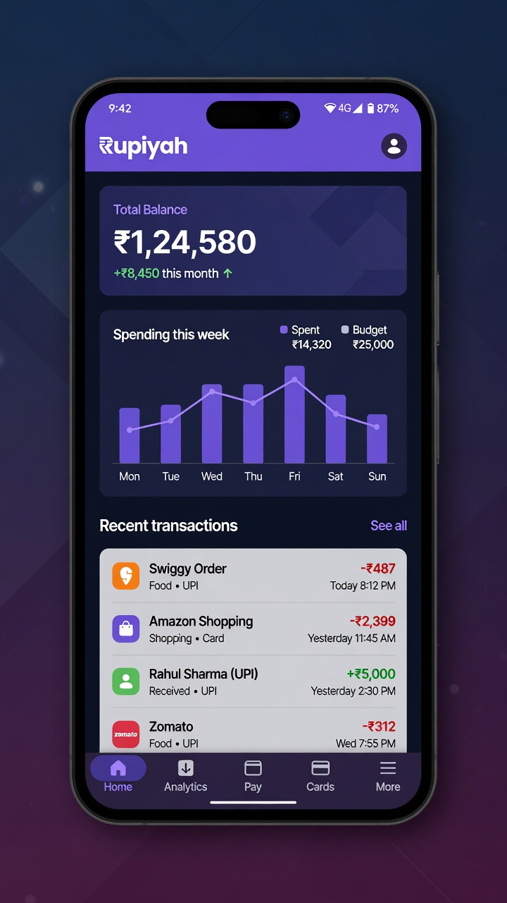
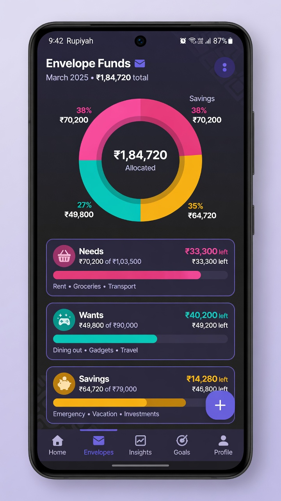
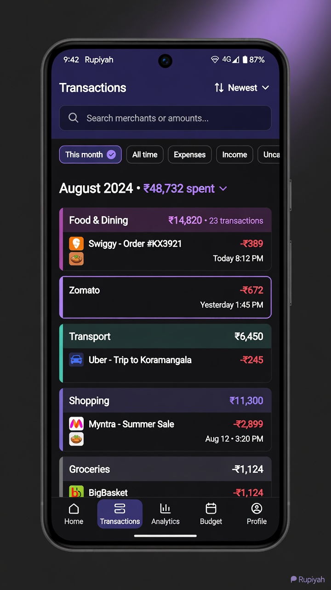

<p align="center">
  
</p>

<h1 align="center">Rupiyah</h1>

<p align="center">
  <strong>Open-source personal finance tracker for Android (INR)</strong><br/>
  Auto-import bank &amp; wallet mail · envelope funds · categories · optional LLM extraction
</p>

<p align="center">
  <a href="LICENSE"></a>
  
  
  
  
</p>

<p align="center">
  
</p>

---

## Screenshots

<p align="center">
  
  &nbsp;
  
  &nbsp;
  
</p>

<p align="center"><em>Marketing previews — UI styling may differ slightly from your build.</em></p>

---

## Why Rupiyah?

Most money apps lock your data in the cloud. **Rupiyah keeps finance data on your device**, pulls transactions from mail/SMS you already receive, and stays open source so you can audit every line.

| | |
| --- | --- |
| 📬 **Email ingest** | Gmail via Google Sign-In (`gmail.readonly`) **or** IMAP App Password |
| 💬 **SMS** | Optional bank/wallet SMS monitoring |
| 🧠 **Smart parse** | Rules-first extraction + optional OpenAI-compatible LLM (Groq, OpenAI, local) |
| 🏦 **Accounts** | Cash, UPI, and custom bank balances |
| 🏷️ **Categories** | Editable icons and labels |
| 봉투 **Envelope funds** | Allocate spending with a fund ledger |
| 🔔 **Classify fast** | Notifications + quick actions |
| 📍 **Location** (optional) | Match spends to places |
| 📊 **Sheets export** | One-way Google Sheets workbook |
| 💾 **Backup** | JSON export / restore |

---

## Quick start (users)

1. Install a [release APK](https://github.com/krtky/finance-tracker/releases) or [build from source](#build-from-source).
2. Open **Settings → Profile** and set your display name.
3. **Settings → Intelligence → LLM Providers** — paste an API key  
   → [docs/OPENAI_API_KEY.md](docs/OPENAI_API_KEY.md)
4. **Settings → Email** — Google Sign-In *or* IMAP App Password  
   → [docs/GMAIL_IMAP.md](docs/GMAIL_IMAP.md)
5. Add **Trusted senders** for your banks and wallets.
6. Optionally enable **SMS transactions** and list sender IDs.
7. Add **Bank accounts** under Money for clear labels on each spend.

Longer walkthrough: [docs/Rupiyah User Guide.pdf](docs/Rupiyah%20User%20Guide.pdf)

---

## Build from source

### Requirements

| Tool | Version |
| --- | --- |
| JDK | **17** |
| Android SDK | **35** |
| OS | Windows / macOS / Linux |
| IDE (optional) | Android Studio Ladybug+ |

### Clone & debug build

```bash
git clone https://github.com/krtky/finance-tracker.git
cd finance-tracker
```

**Windows (PowerShell)**

```powershell
# Point JAVA_HOME at a JDK 17 install if needed
$env:JAVA_HOME = "C:\Program Files\Microsoft\jdk-17.0.19.10-hotspot"
.\gradlew.bat assembleDebug
```

**macOS / Linux**

```bash
./gradlew assembleDebug
```

Debug APK: `app/build/outputs/apk/debug/app-debug.apk`  
(package id suffix: `com.krtky.financetracker.debug`)

### Signed release

Secrets stay **out of git**. Choose one approach:

**A. `keystore.properties` (recommended)**

```bash
cp keystore.properties.example keystore.properties
# edit storeFile, storePassword, keyAlias, keyPassword
# place your .jks under keystore/ (already gitignored)
```

```powershell
.\gradlew.bat :app:assembleRelease
```

**B. Gradle properties / CLI**

```powershell
.\gradlew.bat :app:assembleRelease `
  -PRELEASE_STORE_FILE="keystore/your-release.jks" `
  -PRELEASE_STORE_PASSWORD="***" `
  -PRELEASE_KEY_ALIAS="***" `
  -PRELEASE_KEY_PASSWORD="***"
```

Output: `app/build/outputs/apk/release/app-release.apk`

Also see [`.env.example`](.env.example) for a checklist of local secret names (the app does **not** load `.env` at runtime).

### Google OAuth (Sheets + Gmail Sign-In)

See [CONTRIBUTING.md](CONTRIBUTING.md). You must register your signing cert **SHA-1 / SHA-256** on an Android OAuth client in Google Cloud Console. The app never ships a client secret.

---

## Project layout

```
app/src/main/java/com/krtky/financetracker/
├── ui/           # Compose screens, components, navigation, ViewModels
├── data/         # Room, repos, email/LLM/Sheets, SecureStore
├── domain/       # Models
├── email/        # Live mail monitor service
├── sms/          # SMS receiver
├── notification/ # Classification prompts
├── location/     # Optional location services
├── widget/       # Home screen widgets
├── workers/      # Background work
└── di/           # Hilt

docs/             # User & setup guides, images
sheets/           # Google Sheets template notes
keystore/         # Your local .jks only (not committed)
```

Deep dive: [docs/ARCHITECTURE.md](docs/ARCHITECTURE.md)

---

## Tech stack

- **UI** — Jetpack Compose, Material 3 Expressive
- **DI** — Hilt
- **DB** — Room
- **Async** — Kotlin Coroutines / Flow, WorkManager
- **Network** — OkHttp (Gmail API, Sheets API, LLM)
- **Mail** — JavaMail IMAP (optional IDLE)
- **Security** — EncryptedSharedPreferences (AES-256 GCM)
- **Build** — AGP 8.7, Kotlin 2.0, minSdk 26, targetSdk 35

---

## Configuration & secrets

| What | How |
| --- | --- |
| LLM API key, model, base URL | **In-app** Settings → Intelligence |
| Gmail IMAP password / OAuth | **In-app** Settings → Email |
| Google Web client ID | **In-app** Settings → Google |
| Release keystore | `keystore.properties` or `-PRELEASE_*` |

Runtime secrets use `SecureStore` (encrypted prefs). They are **never** hardcoded in the repository.

Developer options: on **Settings**, tap the version line **seven times** to unlock LLM system prompt, classification delay, and status helpers.

---

## Security

- Secrets: EncryptedSharedPreferences (AES-256 GCM)
- Release: R8 minify + resource shrink
- Backup JSON **includes** API keys and passwords — treat backups as secrets
- Gmail access is **read-only** (IMAP or `gmail.readonly`)
- Do not commit `local.properties`, `.env`, `keystore.properties`, or `*.jks`

Full policy: [SECURITY.md](SECURITY.md)

---

## Contributing

PRs welcome. Start with [CONTRIBUTING.md](CONTRIBUTING.md).

```powershell
.\gradlew.bat lint
.\gradlew.bat test
```

Please:

1. Keep one feature or fix per PR  
2. Prefer clear Kotlin + Compose style (`kotlin.code.style=official`)  
3. Update docs when behaviour changes  

---

## License

[Apache License 2.0](LICENSE)

---

## Disclaimer

Rupiyah is a personal tool, not a bank product. Parsing of SMS/email is best-effort and depends on your bank’s message format. Always verify balances with your bank.
